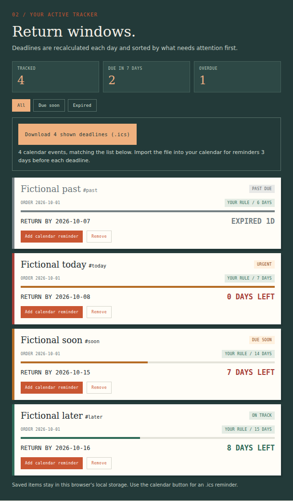

# Bulk calendar export qualification

Source issue: [#18](https://github.com/Jacob-Met/returnby/issues/18).

## User outcome

The shopper can download the deadlines shown by the current All, Due soon or Expired filter in one `.ics` file. The control displays the event count and disables at zero. Each event retains the same order UID, all-day return date, exclusive next-day end date, escaped text and three-day display alarm as an individual export. Export does not write saved data or clear an unsaved draft.

The control is mounted once outside the replaced list. Every render supplies its current rows, including the empty set, before the list's empty-state return. A midnight refresh with unchanged event count still replaces the captured identities. When the focused export becomes disabled, focus moves to the selected filter. Other focus remains where the shopper left it.

## Exact source

- Repository: `Jacob-Met/returnby`.
- Authoring base: `3913697f70a31d73e8fe7d02b686b306830c24db`.
- Base tree: `ab4534a2e1afdace5d27a6079012c776c0e66f70`.
- Original calendar serializer blob: `2b2b540cf58bab78b2aba84a70d748b6f9cd82b4`.
- Final four-path production patch SHA-256: `ec9b10f44a9dcb6529f8ab9b499af58abb00b41c3036a4420134ddcf44c9c14c`.
- Focus correction from the first candidate SHA-256: `ab2d84d9bcaf070c99837ee4bc21477e2a07a6785374d3a390e3164789947fba`.

The full upstream tree, including merged day-refresh PR #17, was materialized and its 33 file blobs verified before implementation. The base commit was reconstructed to its exact signed Git object. Production changes are limited to `src/ics.ts`, `src/main.ts`, `src/calendar-export.ts` and `src/calendar-export.css`; the existing day-refresh callback is preserved. `production-hashes.json` records the final source hashes. This contribution does not add the separately owned storage/editor/parser stack to main.

## Executed evidence

| Receiver | Result | Retained evidence |
| --- | --- | --- |
| Original production build in isolated Chromium | The per-order calendar downloaded successfully; the bulk-control assertion failed with `0 !== 1`, establishing the missing user capability. | `baseline-browser.log`, `baseline-browser.json` |
| Native suite and production build | All 28 inherited tests passed before changes. The final source passes all 32 tests across four files and TypeScript/Vite build. | `native-results.json` |
| Original single-order byte compatibility | 39 changed-input vectors across Unicode, line breaks, punctuation, controls, leap day and year rollover produced identical output bytes: 33,924 serialized comparison bytes. | `single-export-parity.json` |
| Author's real-browser suite | Five groups passed; 13 actual downloads covered all filters, reviewed Save, Remove, Clear, draft preservation, equal-count midnight identity replacement, resume, Unicode and keyboard use at 360 px. | `author-browser.log`, `author-browser.json`, `tools/check_calendar_browser.mjs` |
| Independent first candidate review | Five broad groups passed and nine calendars downloaded, but the focused export moved to BODY when midnight emptied the filter. This failure led to the narrow caller-supplied focus fallback. | `independent-r1-focus.json` |
| Independent corrected-source review | All three bounded focus groups passed, including same-count identity replacement, selected-filter fallback at zero and preservation of textarea focus/text; three actual calendars downloaded. | `independent-r2-focus.json` |
| Independent single-order byte compatibility | 40 independently selected vectors matched the original serializer exactly. | `independent-single-compatibility.json` |

The browser runs used fictional saved orders in disposable contexts, loopback-served production assets and a controlled UTC clock. Author runs reported no page errors or external requests. The browser receiver validates downloaded UTF-8 bytes, calendar/event boundaries, literal escaped text, stable identities, all-day dates, next-day ends and one three-day display alarm per event. The focused-to-empty regression is retained in the published browser tool.

The independent first review was written before candidate inspection. Its broad results apply to the unchanged serialization and download scope; its failed focus boundary was explicitly rerun on the corrected source. An initial corrected-focus attempt was interrupted by temporary filesystem exhaustion; the successful retry used the same frozen source. The failed first-candidate report remains present rather than being replaced by the passing result.

## Reproduce

```bash
npm ci
npm test
npm run build
node --test tools/check_calendar_browser.mjs
```

The final command requires a separately available Playwright module and Chromium. It accepts `RETURNBY_PLAYWRIGHT`, `RETURNBY_CHROME`, `RETURNBY_BUILD` and `RETURNBY_CALENDAR_OUTPUT`. No production dependency or lockfile change is required. The test runner records real downloaded calendar files and their hashes. To reproduce the missing-capability witness, serve the pinned base build using `RETURNBY_BUILD` and run the same tool with `--test-name-pattern='exports all currently displayed'`; its bulk-control assertion fails after the single-order download succeeds.

## Visual review

The final desktop and narrow-screen captures were visually inspected. The button remains readable, has a minimum 44 px height and a visible keyboard-focus outline. The new control fits a 360 px viewport.




## Practical boundary

The calendar file is a snapshot. ReturnBy does not sync later edits or removals into a previously imported calendar. Calendar applications decide how to handle a repeated UID and whether to present imported alarms. These runs verify the downloaded files in Chromium; they do not claim an observed Google Calendar, Outlook or Apple Calendar import. The files contain the same reviewed fields the existing individual export already uses.

The separately owned storage/editor stack has an additional `loadFailed` render branch. Its integration must supply `updateCalendarExport([])` before hiding the saved rows, so an unavailable tracker cannot leave a previous export snapshot active. Root performed a separate bounded composition check on PR #16; that receiver's evidence is recorded separately and its production stack is not part of this patch.
