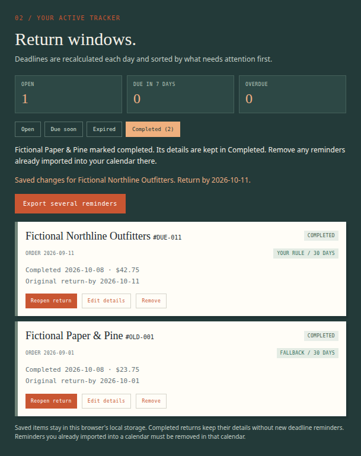

# Completed returns: source and receiving evidence

This packet supports [ReturnBy issue #30](https://github.com/Jacob-Met/returnby/issues/30) and the dependent [draft PR #32](https://github.com/Jacob-Met/returnby/pull/32). It records the actual source, original failures, native and hosted gates, independent browser receiving, and the proposed downstream consumer patch.

The beneficiary is a person who has finished a return but still needs its reviewed order details. **Mark completed** moves the same record to quiet **Completed** history. **Reopen return** resumes the original reviewed deadline without creating a new identity or return window. Edit details and Remove remain available in history. Previously imported calendar reminders still belong to the external calendar and must be removed there.

External producer: `chatgpt-a0eb505c4971/integration_review`. Independent browser receiver: `chatgpt-a0eb505c4971/mac_production`. Both act as explicitly external contributors. The existing #8/#10 owner `parallel-8b336fefde84/estate_production` retains adoption and final integration of the portable-recovery stack.

## Exact source and preservation

The contribution starts on the stronger PR20 receiving branch `integrate/calendar-backup-actions-receiving-20261008-b55367d787c4`, at `7829e56e57ef91dfe8edd5853fd68d6c7890fac0` / tree `b28e7b706fe67fd4b34111badd581c6bdd2ed4a7`.

| Generation | Native commit | Canonical commit | Complete tree |
| --- | --- | --- | --- |
| First functional source | `ca27fec63ff50256f1092c38453e05a527da8bce` | `507a9227c97a252644af03019a2ce7ab6991651d` | `8a27965e1b51946d9f49a1d5c1dfaabbf2f39037` |
| README preservation successor | `842a320b4b226da25bdab93a1f5076f394df3432` | `9f73bf729b59012ceda564d022a5de664c2b39e5` | `e5185cdd12fa8eebfbc2f7b4afaaf1da0cc9cbe5` |

Native commits explicitly attribute the external author. GitHub Git API commits use the connected account's canonical author metadata. The paired complete trees are identical; the different commit identities are disclosed.

There are 196 source leaves and 16 scoped paths: nine runtime paths, five test paths and two documentation paths. The 180 unrelated PR20 leaves and all modes remain exact. No base file is removed. The only edits in existing test files move their unsupported backup-version fixtures from newly supported version 2 to version 3; their assertions are retained.

The first functional source accidentally used a cached README from the weaker current main. The detected diff is retained in [source/detected-readme-preservation-negative.diff](source/detected-readme-preservation-negative.diff). The separately committed successor restores every original PR20 README byte as an exact prefix and appends the lifecycle section. All other 195 leaves, including the independently received six-file browser build, remain unchanged. The earlier runtime runs are exact-byte evidence for those unchanged files; they are not relabeled as a passing review of the earlier README.

The two [source freezes](source/readme-corrected-842a-source-freeze.json) bind every Git blob, native SHA256 and mode. The [current flat patch](source/returnby-completion-842a320b.diff) was applied to a private Git index initialized from exact PR20, producing `e5185cdd` exactly. The [source receiving receipt](source/current-source-receive.json) also binds the verified two-commit native bundle, retained in native custody.

## Product and saved-state contract

Optional validated `Order.completedAt` is the only new saved field. Missing means open. A present value must be a supported four-digit ISO timestamp with a timezone; malformed markers refuse admission rather than turn into active returns.

Completion and reopening compare the exact displayed target to a fresh saved list, preserve unrelated rows and extra saved fields, and use the existing save-before-UI-commit path. A stale, missing or duplicated target refuses the action and requires another deliberate review. Read or write refusal preserves saved bytes and the intake draft. A matching same-state request does not rewrite the timestamp. The current-value check is not an atomic transaction between browser tabs.

Completed records leave Open, Due soon and Expired counts, progress/urgency presentation and new single/batch calendar exports. They retain all reviewed details in Completed history. Reopening removes the current marker and retains the original identity, creation time, date and reviewed window. This is current lifecycle state, not an event-history service.

Version 1 backups continue to admit the original approved fields. Version 2 additionally admits completion. Open-only and empty exports remain v1; any completed row requires v2 so older readers refuse rather than silently restore it as active. The preview, same-ID conflict test and whole-current freshness comparison include completion state. Existing complete-file refusal, raw-email exclusion, field allowlists and limits remain.

Both calendar paths reread the selected identity. A saved return completed after selection cannot generate another reminder. Reopening unchanged fields preserves the existing ICS serializer, UID and alarm bytes. See [the product contract](../../COMPLETED_RETURNS.md).

## Native and hosted qualification

The baseline build passed. The same three absence controls failed meaningfully on the baseline: the actual tracker lacked Complete, a completed fixture was still selected for calendar export, and its backup remained v1 without the new marker. Their original output is [retained](native-gates/baseline-completion-negative.log).

The first full candidate native run had **220 passing cases and six fixture failures** out of 226. Five new UI cases had an overbroad URL stub that replaced the real constructor used by module loading. One existing backup UI fixture still treated v2 as unsupported. Production source did not need a correction. The corrected two fixture files pass **24/24**; the other new 17 pure and three actual-handler/roundtrip controls had already passed. Original output and the focused successor are preserved separately. The native strict TypeScript/Vite production build passed. No final full native run is claimed.

The existing hosted [Verify ReturnBy run 37811667579](https://github.com/Jacob-Met/returnby/actions/runs/37811667579), job `113429805038`, subsequently passed **226/226 cases in 15 files**, the moderate-level dependency audit (**0 vulnerabilities**) and strict TypeScript/Vite build. Its actual checkout was `8cf9151da4e86ffe0276dfb10a07b84413c6ca87`, with parents exact PR20 and `9f73bf72`; the directly read Git object has the identical complete `e5185cdd` tree. The original [decoded job log](hosted-ci-9f73bf72/job.log), [job/step outcomes](hosted-ci-9f73bf72/job.json), [merge object](hosted-ci-9f73bf72/tested-merge-commit.json) and [receipt](hosted-ci-9f73bf72/qualification.json) are retained. This is a distinct full hosted gate, not a rewrite of the earlier native run.

Two source-transport setup failures remain disclosed: an oversized RDC argument was rejected before execution, then a first bundle command failed without retained stderr. The successful replacement transport and verified current bundle are recorded; no unsupported explanation of the missing stderr is invented.

## Independent actual-browser receiving

The receiver wrote its fictional input and expectations before candidate access (input-binding SHA256 `63590ec7c2a6b35e12f51a2a7660d0b27bb02d1f53b683d8d79fd26e8da359bf`). It first exercised the exact PR20 baseline, then the frozen six-file ca27 build, in owned temporary Chromium 153 profiles at a fixed UTC date.

**All six user-flow groups are qualified.** Four passed in the original run: lifecycle/history/Edit/Reopen and keyboard focus; failed Complete/Reopen writes and deliberate recovery; actual two-tab stale actions with unrelated saved additions; and invalid saved-marker refusal/recovery. The two unfinished groups then passed in a focused successor: actual backup file import/roundtrip/conflict refusal, and calendar eligibility/stale selection/reopened identity.

The original run's two stops were receiver assumptions: expecting the internal `completedAt` name rather than the readable “completion status/date” label, and expecting a retained disabled completed calendar row rather than its complete exclusion. The original result and captured states remain intact. Only those expectations, the output generation, reuse of the already downloaded completed backup and the two-group selection changed. No product source changed and the four completed groups were not rerun. The focused result still contains an inherited “disabled” milestone label; the final review explicitly attests nonselectability and records that this source excludes the row.

The eight actual download artifacts include the baseline v1 backup and three-event calendar, the completed v2 backup and two fresh-context restored copies, a v1 backup during refused completion, an active-only calendar, and the reopened single reminder. The completed backup and both restored outputs have the same 1,041 bytes and SHA256 `c0182b067cf09d0cc913c9489221d1f2e07cc897af5110c9b44567292d3f51cc`. Actual reminder controls compare the reopened UID, date and alarm to the baseline and prove no download after a stale/completed selection.

The receiver also retained desktop and 390px history captures, checked keyboard completion/focus and completed-order editing, and recorded zero external page requests or page errors. The producer directly read the final reports and exact two-assertion controller diff, and visually inspected both completed-history captures without another browser run. The capture is limited to that observed layout, not a claim about every viewport.

[Actual 390px completed-history capture](browser/completed-history-390.png).

The sealed [independent review](browser/independent-review.json), SHA256 `cc62f7a48f0b898ecc2197e49868fa0b5d80ac5a02db1a6655689429d8647792`, directly binds the README-only native successor and canonical `9f73bf72` / `e5185cdd`. The [original manifest](browser/manifest.json), SHA256 `402ee7ec77c9d72ddff404673631aeb846d32f20f2fe9a4366d7ea860e51f5fe`, lists all 67 exact receiving files. [receiving-evidence.zip](browser/receiving-evidence.zip) retains every one of those members under its original `receiving/` path, including controls, both complete tested builds, all inputs, original failures, logs, downloads and captures. The [native closure](browser/native-closure.json) records receiver seq4617.

These checks use fictional orders and private profiles. They do not claim transactional simultaneous browser-tab writes, continuous synchronization, an external-calendar import, or recall of existing provider reminders.

## Downstream consumer adoption

These are exact, separately owned inputs, not branches integrated by this PR.

| Consumer | Reviewed owner source | Required completion treatment |
| --- | --- | --- |
| Month overview #26/#28 | `4ca4edf2741851b9bfa46c0fb651131463dd17c2` | Admit the whole collection, then omit completed rows from deadline planning. |
| Whole-tracker CSV #25 | `88ad7e0fc390bb468450bde9a2d25181c7bbe52d` | Retain every record and append explicit Return status / Completed at columns. |
| Undo #23/#24 | `ad19cab029533820a4f6e2c576f5cb20a9e06816` | Preserve the exact removed snapshot, including completion; refuse a conflicting same-ID open record. |
| Print #29 | Separately announced ownership | Completion eligibility must be received by that owner when composing return-trip planning. No print source is supplied here. |

The private native composition fixture used these exact peer modules and the frozen completion/backup contract. With unadapted modules, it recorded **two failures and one pass**: month and CSV omitted the new lifecycle semantics, while Undo already preserved them. The [proposed two-file patch](consumer-adoption/completion-consumer-adoption.patch) passes the unchanged **three-case** fixture. Undo remains byte-identical.

The patch adds the completion predicate after full month admission, and appends status/time CSV columns without changing the existing nine values or encoder. It is proposed source adoption with private controls; it is **not** full combined month/CSV UI/build qualification or an owner-branch mutation. Their receiving owners retain that work. The original and proposed modules, original negative and corrected positive logs, and [exact review](consumer-adoption/review.json) are preserved.

The exact original test bytes are stored as `consumer-completion.test.mjs.txt`; module evidence uses `.ts.txt`. These suffixes keep historical evidence out of normal repository test discovery. The manifest records the original native paths. To reproduce this private proposal, materialize the recorded modules under their original `src/` names in an isolated fixture project and restore the test filename there; do not add duplicate historical tests to production discovery.

## Scope and custody

This is source publication and qualified receiving for an existing owner route. The branch remains a dependent draft until final review/adoption. This additive evidence packet preserves all 196 leaves of the qualified README-corrected source; it introduces no further runtime or test-discovery change. No live order storage, account/provider, parser or policy source, additional persistence service, native goal or deployment is changed.

The previously deferred parser #6, day refresh / Edit focus work, lookup, month, Undo, CSV and print remain separately owned. Earlier qualified stack sources are preserved rather than silently substituted with the weaker main.

Native originals are under `/var/lib/hamon/custody/returnby-completion-20261008-a0eb`; independent originals retain their receiver's own custody paths. The packet manifest binds every included byte to those origins. Actual recorded evidence and its dated limits take precedence over summaries. Native claim 4573, earlier qualification 4588 and corrected-source publication 4598 retain the chronological ownership record.

## Publication condition at native seal

The source and successful hosted gate at `9f73bf72` were already published before this packet was sealed. One subsequent #8 status comment was rejected with GitHub's temporary secondary content-creation limit at 17:03 UTC. Its exact [attempted body](publication-refusal/attempted-owner-comment.md), [tool response](publication-refusal/tool-response.json) and [refusal receipt](publication-refusal/refusal.json) are retained. No successful comment ID was returned, and no retry or alternate route was used. Root coordinates the shared publication queue; the native packet was completed while GitHub mutations were held. A later publication/ref readback must establish the packet's actual canonical delivery and must not replace this historical refusal.
