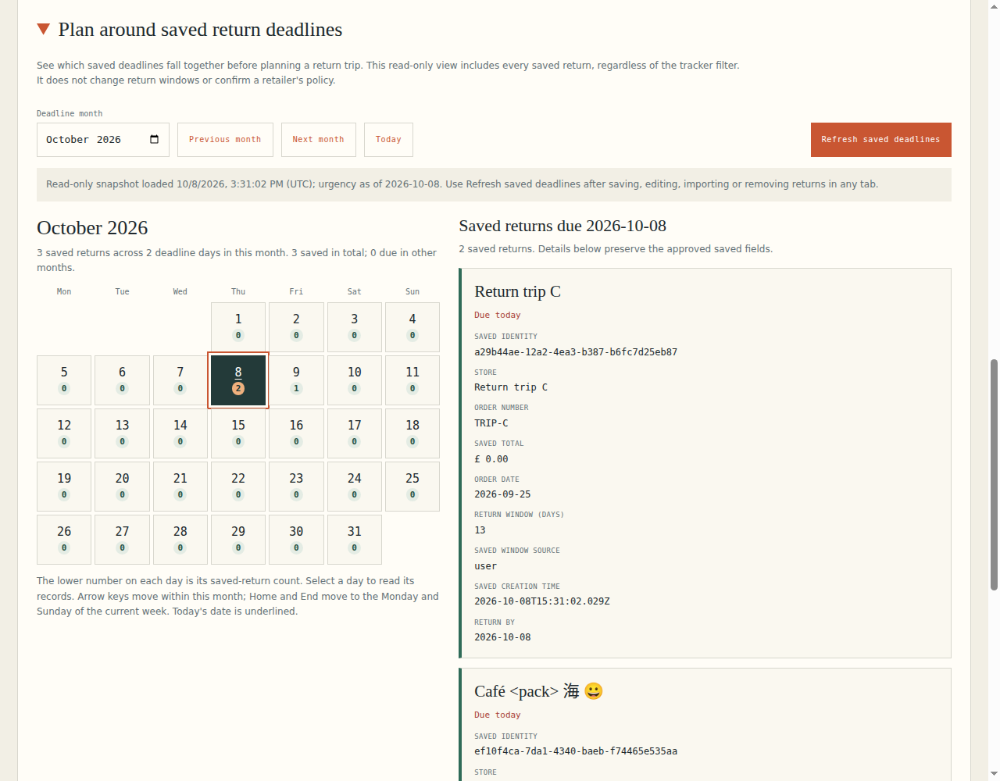
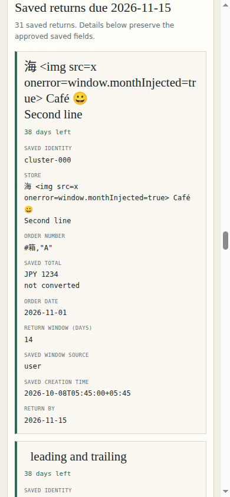

# Received monthly saved-deadline overview

This packet qualifies ReturnBy PR28 head **4ca4edf2741851b9bfa46c0fb651131463dd17c2**
and tree **fa1eb6dbd90a3423422a20cb4b12282fe87b8e6f** on the existing PR20
receiving base **7829e56e57ef91dfe8edd5853fd68d6c7890fac0**.

The product lets a person planning a return trip see a Monday-first month of saved
deadline counts, select a day, and read all of its exact approved records in
20-record pages. It displays the accepted snapshot's time and civil date.
**Refresh saved deadlines** rereads the complete collection after changes in this
or another tab. Unreadable storage or a malformed record refuses the whole
overview while preserving saved bytes and unrelated drafts.

## Qualification and preserved failures

| Phase | Actual checkout / tree | Maintained native result | Actual browser result |
|---|---|---|---|
| Original absence, head8414d3d9 | 3bac025d / 261ff38e | 201 passed; audit and strict build passed | Two real native Save/draft groups pass, then exactly fails “Missing monthly saved-deadline overview entrypoint” |
| First candidate, headb7473da4 | d13a3082 / 3bcf198e | 45 overview cases pass; total192 passed/54 failed because the new main side-effect entry reached older inert DOM fixtures | Seven groups pass through real other-tab refresh and full refusal; first successful-phone screenshot adapter times out |
| Received successor, head4ca4edf2 | 858df955 / fa1eb6db | All246 tests in13 files pass, including201 original and45 new cases; audit and strict build pass | All9 groups and10 artifacts pass; all30 source and6 build inputs unchanged |

The successor restores **src/main.ts byte-for-byte** and adds the independent
overview entry as a69-byte HTML module script. The model, UI, CSS, entry and45
model cases remain identical to the first candidate. Existing owner tests are
unchanged. The capture helper now foregrounds its current CDP target and waits
for two native paint frames. Removing exactly those two lines recovers the
original41,498-byte frozen receiver. No consumer case, assertion, fixture or
workflow was changed. The first capture timeout remains evidence; missing target
foregrounding was a source-based hypothesis, not a uniquely proven diagnosis.

## Actual user workflows received

The browser creates three records through the shipped Review/Save flow, stages
an unsubmitted intake, then consumes an authored43-record backup through the
native file picker and reviewed import. It checks14 independently frozen
month/year/leap/range cases in each of UTC, America/New_York and Pacific/Auckland.
An independent standard-library calendar/date computation also confirms all43
fixture deadlines,14 month maps and three primary deadlines.

All31 records on one selected day remain reachable across20+11 pages. The gate
compares every displayed approved field with the source, including literal
markup, Unicode, a leading U+FEFF order number, multiline amount text and explicit
timezone creation timestamps. Native keyboard day navigation and page focus are
received. An actual second-tab Edit/Save preserves the saved identity and
creation time; the first view keeps its old labeled snapshot until explicit
Refresh moves that identity to its new deadline. An uncommitted backup and
new-order draft stay intact.

Confined authored read failure and a malformed last record refuse the complete
overview without a storage write or stale accepted label; restoration and
explicit retry recover. The390px view has no horizontal overflow, date targets
at least44px (43.5px geometric tolerance), and literal wrapped fields. One
original calendar download preserves its actual saved UID,2026-10-09 start,
next-day end and three-day reminder. A native confirmed Clear yields an honest
empty month. The actual first-tab writes are exactly3 Save,1 reviewed import and
1 confirmed Clear; overview-only operations add none. The second tab has exactly
one explicit native Edit/Save write.

## Source and evidence custody

[Source proof](source-proof.json) compares the complete191-leaf original tree
with the199-leaf qualified tree:189 original leaves are exact, only index.html
and README have additive changes, and8 files are added. Existing persistence,
backup, editor, calendar, policy, main, tests, workflows and dependency pins are
unchanged. All30 source inputs reported by the actual browser were independently
fetched from native Git and rehashed. The stored build hashes bind the actual
built assets consumed by the browser.

[Independent receiving](INDEPENDENT-RECEIVING.json) contains the parent's complete
source/graph/hash review, independent date oracle, native raw-log and artifact
readback, exact calendar receiving and direct visual findings. Both receivers
decoded and verified all157 final numbered chunks,482,236 payload bytes and11
members (360,523 raw bytes). The [index](index.json) pins every artifact and raw log
by native Git blob, byte count and SHA256. All original and first-candidate
failure members are preserved in their separate directories.

The actual final environment was Node22.23.3 and installed
Chrome154.0.8037.57 on hosted Ubuntu. The owned receiving workflow qualifies
fonts-noto-cjk1:20230817+repack1-3 and Noto Sans CJK JP font file
SHA256b76b0433203017ca80401b2ee0dd69350349871c4b19d504c34dbdd80541690a.
No project framework, runtime dependency or existing workflow was changed.

Actual final runs:
- [Maintained246-test/build gate](https://github.com/Jacob-Met/returnby/actions/runs/37801322989), job113393994818.
- [Nine-group native browser gate](https://github.com/Jacob-Met/returnby/actions/runs/37801323129), job113393996444.
- [Preserved original201-test gate](https://github.com/Jacob-Met/returnby/actions/runs/37799407699), job113387300165.
- [Preserved original absence](https://github.com/Jacob-Met/returnby/actions/runs/37799407832), job113387300931.
- [Preserved first-candidate native result](https://github.com/Jacob-Met/returnby/actions/runs/37800755478), job113392002764.
- [Preserved first-candidate capture result](https://github.com/Jacob-Met/returnby/actions/runs/37800755351), job113392004010.

## Direct visual receiving

Both receivers displayed and inspected all four actual final PNGs from the
hashed bundle: desktop overview, phone overview, selected-day phone record and
phone refusal. The visible controls, counts and snapshot/refusal wording are
readable; literal海/markup/emoji and multiline saved fields wrap within the
selected record. No clipping, overlap or horizontal-overflow blocker was found.
These are real captured viewports; vertical scrolling is expected, and complete
offscreen record coverage is supplied by the actual DOM/action assertions.

## Adoption and limits

This is a ready source handoff on PR20's accepted receiving composition.
**PR8/PR10 retain main adoption.** This evidence branch does not move their refs,
merge their stack, qualify the separate lookup/Undo/CSV/day-refresh/parser
compositions or deploy a site.

The view needs explicit refresh after saved state changes. It follows native
backup admission (years1000–9999,10,000 records,5MiB) and native deadline semantics.
Saved amounts and window-source labels remain historical recorded text, not
verified current retailer policy. Receiving covers the actual hosted loopback
browser, authored cases and displayed viewports; no physical-device,
screen-reader, live deployment or continuous synchronization claim is made.
