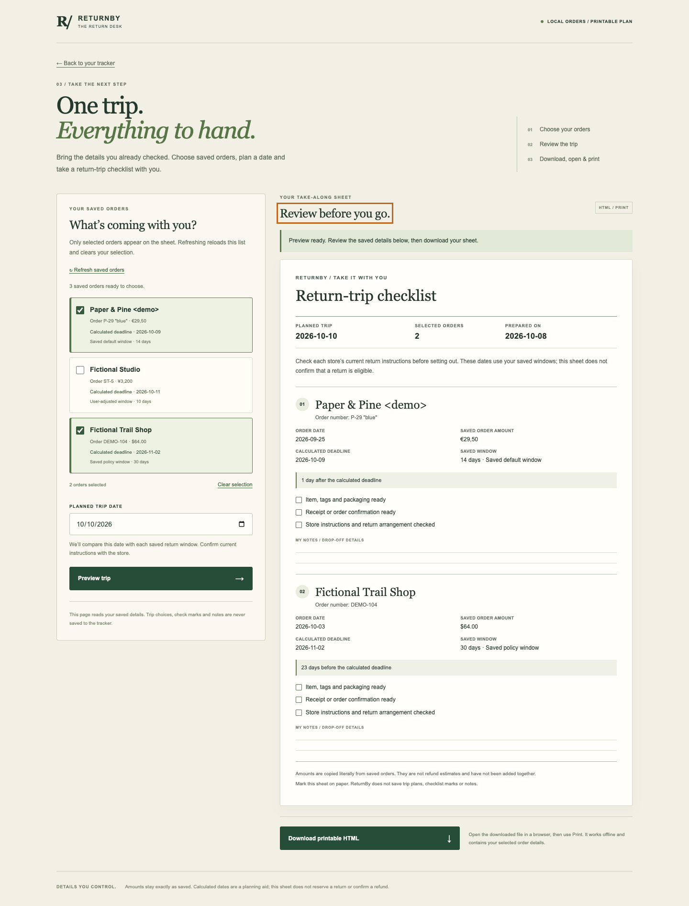
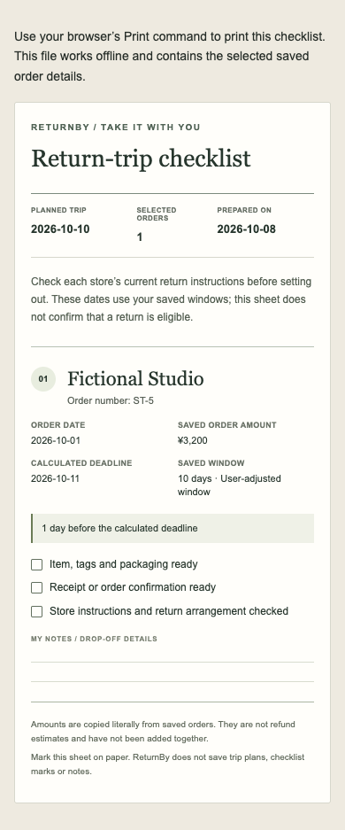

# Return-trip checklist — native receiving

This addition lets a shopper choose saved ReturnBy orders, review a planned return trip and download a self-contained HTML checklist to open offline and print. The original tracker remains the source of saved orders.

## Source and actual qualification

- Canonical baseline: `3913697f70a31d73e8fe7d02b686b306830c24db`, tree `ab4534a2e1afdace5d27a6079012c776c0e66f70`.
- Frozen native production candidate: `3b863ad63c998f65fc8db686185dd8450aa9a6b5`, tree `a6e2f455d22971a240cd8334350247bed678a842`.
- The native baseline commit materializes all 33 canonical blobs/modes exactly. It is an isolated verification repository and does not claim to reproduce upstream Git commit history.
- Source claim: [ReturnBy #29](https://github.com/Jacob-Met/returnby/issues/29). The nine production/test/guide files in `source-freeze.json` were independently reviewed; the receiver and this evidence were added afterwards without changing those bytes.

The unchanged baseline passed 28 native tests and its build. In a fresh native Chrome profile, the original review form saved a fictional order and its calendar action downloaded a real 422-byte ICS for the calculated deadline. There was no checklist entry, and `/trip-checklist.html` returned 404.

The qualified candidate passes **68 native tests** (the original 28 plus 40 focused cases) and builds both entries. **17 actual Chrome receiving groups** pass, including two completed HTML downloads, offline `file://` reopening matching the on-screen preview, print-media receiving and an actual Chrome-generated PDF, keyboard selection, a 390px view, original tracker cross-tab removal, same-tab stale-data detection, blocked storage/getter handling and malformed/duplicate saved-data refusal. No product storage write, external request, console error or script error was observed during the checklist cases. The original tracker and explicit fixture setup writes are recorded separately in the receiver.

## Inspect the result





The two authored example downloads are `desktop-returnby-trip-2026-10-10.html` (6,831 bytes, SHA256 `5dc977d0726a1f7b3170cf62c6026852c93ac6b687d9d23614fbcb538699f49f`) and `phone-returnby-trip-2026-10-10.html` (5,782 bytes, SHA256 `3d3ea68a73d184ef31dae1d8a8811fdfe5013d11f7928c82328cc78386764efe`). They contain fictional order details. They are actual browser-saved files, not reconstructed examples.

Every amount stays literal. Source labels remain policy/default/user as saved. Dates use the unchanged tracker arithmetic and are explicitly a planning aid. The sheet neither confirms retailer eligibility nor estimates a refund. Unselected orders and creation timestamps are excluded; there are no scripts or remote assets in the downloaded sheet.

## Receipts and retained negative run

`baseline-browser.json` records the original native user flow. `baseline-commands.json` records the untouched install/test/build commands. `native-test-build.json` records the qualified commands; the `.txt` log views remove ANSI terminal formatting only, and their original raw-log hashes remain in that receipt.

The first native candidate run is retained in `initial-native-run.json`. It passed the 28 existing tests but found two preparation problems: a Vitest table expanded an empty array into an undefined argument, and an expectation incorrectly assumed the unchanged date formatter padded years below 1000. The table was corrected and the actual supported four-digit date range was made explicit in the new page. Shared date logic was not changed. The original failed log and all intermediate bytes remain in native custody.

`independent-production-review.json` is a bounded source review against all nine frozen hashes. It does not claim a second test or browser run. `browser-receipt.json` binds the successful actual receiver and all tracked source/runtime hashes.

The complete native evidence, including the two additional page/print captures, actual print PDF, raw command logs, materialization receipt, original ICS and failed first-run output, remains under `/Users/me/hamon-mcp-lab/returnby-checklist-81ba1ed0179c`. This repository contains the two screenshots above and the selected exact receipts/downloads; the remaining artifact names in the browser receipt refer to that complete native custody.

## Reproduce

Run `npm ci`, `npm test` and `npm run build` from the checkout. Existing dependency files and maintained workflows are unchanged. The native run reused the installed dependency cache with `npm ci --offline --ignore-scripts --no-audit --no-fund`; this is not an audit result.

With an existing Playwright installation and Chrome available:

```sh
PLAYWRIGHT_MODULE=/absolute/path/to/playwright/index.mjs \
CHROME_PATH=/absolute/path/to/chrome \
node tools/verify_trip_checklist.mjs /absolute/path/to/checkout /absolute/path/to/new-evidence
```

The receiver creates an exclusive evidence directory, an ephemeral loopback server and a fresh browser profile. It uses only authored fixtures, closes its browser/server and removes its own closed profile. No provider account or user profile is involved.

Source integration and hosted deployment are separate from these native receipts. The maintained CI and Pages jobs remain authoritative for the published head; no hosted release is claimed in this source snapshot.
